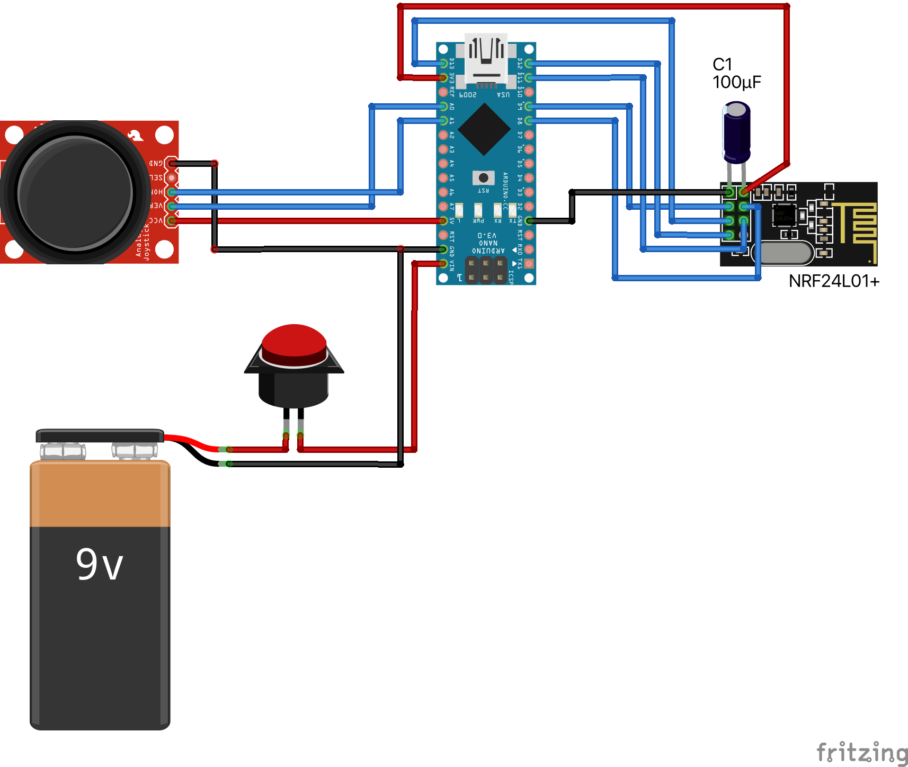
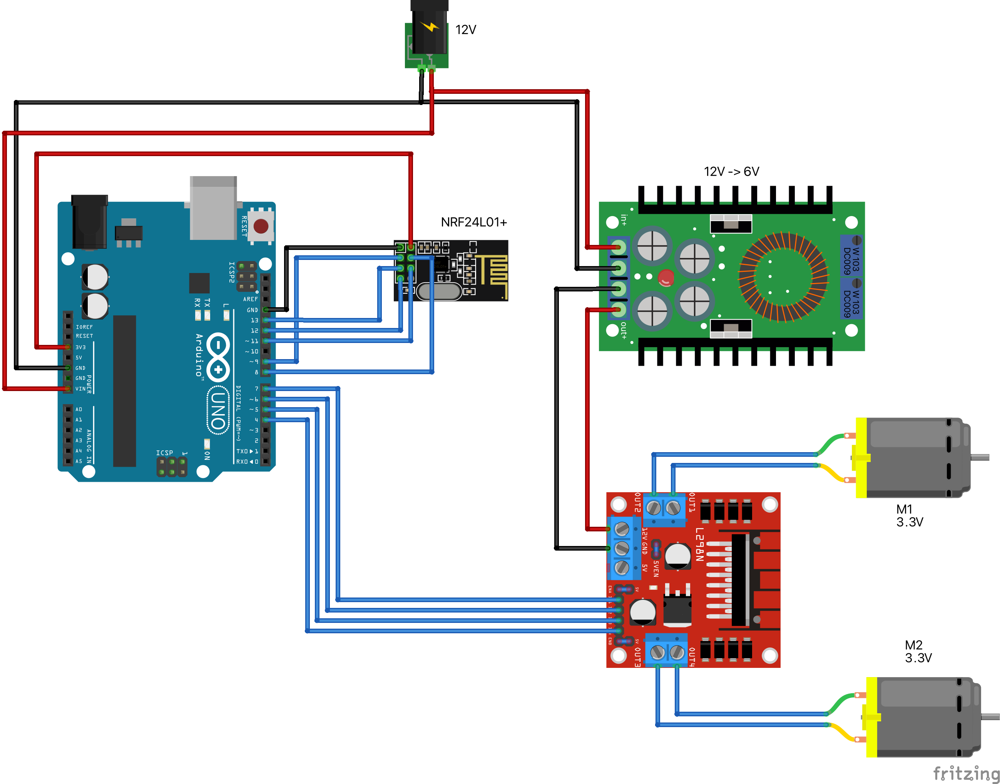

# DIY radio control boat

The project files for creating a simple radio control boat. At the heart of both parts - transmitter&receiver - are arduino board together with the [NRF24L01 radio module](https://www.amazon.com/Makerfire-Arduino-NRF24L01-Wireless-Transceiver/dp/B00O9O868G).

For each part the repo provides the Fritzing project file as well as the source code for the Arduino board.

### Transmitter

Breadboard view:

### Receiver

Breadboard view:

